# Architecture

## The shape

```mermaid
flowchart LR
    subgraph agent["your process"]
        Q[["entry point<br/>(one queue)"]] --> R{route}
        R -->|no interrupt_id| I["agent.invoke(input, thread)"]
        R -->|interrupt_id| RS["agent.invoke(resume_command, thread)"]
        I --> G[["graph.invoke()"]]
        RS --> G
        G -.->|ask&#40;&#41; parks a node| CP[(checkpointer)]
        G --> D{"diff pending()<br/>before vs after"}
    end

    D -->|new| CREATED["wait.created"]
    D -->|gone| RESUMED["wait.resumed"]
    CREATED & RESUMED --> A[["announce adapters"]]
    A --> W(["the world:<br/>topic, queue, bus, table"])
    W --> H([a human, or a timeout sweep])
    H -->|"copy reply_with,<br/>set answer, post to reply_to"| Q
```



Two arrows are worth staring at.

**The loop closes on the same queue it started from.** An answer is not a special kind of
traffic arriving at a special endpoint; it is a message on the agent's ordinary entry
point, and `interrupt_id` is what distinguishes it. There is no answer API to build,
secure, scale or pay for.

**The checkpointer is the only state.** agent-wait writes nothing. What a thread is parked
on is read from the framework every time it is asked, which is why two processes cannot
disagree about it and why there is no repair pass.

## The publisher

`WaitPublisher.invoke()` is the whole library:

```python
before = {p.interrupt_id: p for p in adapter.pending(thread_id)}
result = adapter.invoke(value, config)
after = {p.interrupt_id: p for p in adapter.pending(thread_id)}

for new in after - before:
    publish("created", ...)
for gone in before - after:
    publish("resumed", ...)
```

Two `get_state()` reads per invoke. The framework stays the only source of truth, so
nothing can drift out of sync with it — there is nothing to be out of sync *with*.

That also determines what can be published at all. A wait has exactly two observable
states, parked and not, so there are exactly two transitions. v0.1's `answered`, `expired`
and `cancelled` were transitions of a *record*, describing the library's opinion about an
answer it had accepted; with no record and no answer, they have nothing to describe.

## The adapter

Three methods, and one implementation:

```python
class FrameworkAdapter(Protocol):
    def config_for(self, thread_id: str) -> dict[str, Any]: ...
    def invoke(self, value: Any, config: Any) -> Any: ...
    def pending(self, thread_id: str) -> list[PendingInterrupt]: ...
```

The core never imports LangGraph. `pending()` is where all the framework's sharp edges get
handled, and there is one that matters.

### LangGraph 1.2.x caveat: `tasks[*].interrupts` over-reports

Verified against langgraph 1.2.11 (langgraph
[#4796](https://github.com/langchain-ai/langgraph/issues/4796) /
[#6792](https://github.com/langchain-ai/langgraph/issues/6792)). With two interrupts in
one superstep, resume one, and the *finished* task still lists its interrupt id:

```text
resumed                  = <id-F> (node 'na'); still parked = <id-G> (node 'nb')
task 'na'   interrupts=['<id-F>'] result={'a': {'ok': 1}} error=None
task 'nb'   interrupts=['<id-G>'] result=None error=None
get_state().next         = ('nb',)
```

`next` says `('nb',)` and `task 'na'` has a `result` — but `na` still advertises its
interrupt. The discriminator is **`task.result`**, which holds a finished task's return
value and is `None` only while the task is genuinely parked. `pending()` skips any task
with a result.

Getting this wrong is not subtle in its consequences. `pending()` decides which questions
are published as open, which answers are accepted as still live, and what `republish()`
re-announces. Reading `tasks[*].interrupts` naively would leave an answered approval
showing as open forever, and would accept a second approval for a node that already ran.

`test_a_resumed_parallel_sibling_is_not_reported_as_pending` asserts *both* the correct
behaviour and the raw over-report, so a LangGraph release that fixes the bug fails the
test rather than passing silently. The message on that assertion says the filter may then
be removable.

### LangGraph 1.2.x limitation: two interrupting tools in one `ToolNode`

A second finding, recorded by the same spike, that agent-wait does **not** work around:

```text
first invoke raised      = [('<id-L>', {'which': 'a', 'x': '1'})]
after resuming it        = [('<id-L>', {'which': 'b', 'x': '2'})]
same id for both?        = True
tasks while parked on b  = [('tools', ['<id-L>'], {})]
```

Two tools that both call `interrupt()`, dispatched by one `ToolNode`: only one surfaces
per invoke ([#6624](https://github.com/langchain-ai/langgraph/issues/6624)), and the
second carries the *same id* as the first
([#6626](https://github.com/langchain-ai/langgraph/issues/6626)). That is a different
question under an identical `dedupe_key` — a consumer would discard it — and the task
shows `result={}` while genuinely parked, which `pending()` reads as finished.

There is no filter that fixes this, because the ids are genuinely equal. The rule is
**one `interrupt()` per node**: give each approval-requiring tool its own node.
`test_known_limitation_two_interrupting_tools_in_one_toolnode_share_an_id` asserts the
bug is present so that a LangGraph fix fails the test and this section gets removed.

### What else was verified rather than assumed

`packages/langgraph-wait/tests/test_spike_langgraph.py`, which writes
`reports/langgraph-spike-observations.txt` on every run, pass or fail:

* **`Interrupt.id` is stable** across `invoke(None, config)` re-entry and across
  resume-from-checkpoint. Everything about republishing rests on this: if ids churned,
  every republish would look to a consumer like a new question.
* **Subgraph interrupts** surface on the parent's state against the subgraph node's task,
  with a stable id. `subgraphs=True` is not needed, and resuming by id works through the
  parent.

## Identity and deduplication

| | value | stable? |
|---|---|---|
| `interrupt_id` | LangGraph's | for as long as the question stands |
| `event_id` | a fresh ULID | no — one per publish |
| `dedupe_key` | `"{type}:{interrupt_id}"` | yes |

Consumers deduplicate on `dedupe_key`. This is the mechanism that makes republishing safe,
and republishing is the only recovery path there is, so it carries weight:

* a crash between the invoke and the announce → the redelivered start message finds the
  thread parked, `republish()` re-announces it with the same key;
* an announce adapter that was down → same;
* an adapter added after the question was asked → `republish()` backfills it.

`event_id` exists for logs and for tracing one specific publish. Deduplicating on it would
defeat the whole scheme, which is why `SqsAnnounce` sends `dedupe_key` as the FIFO
`MessageDeduplicationId` and why the README says so twice.

## `expires_at` is anchored to the checkpoint

`PendingInterrupt.asked_at` comes from LangGraph's `created_at` on the state snapshot, and
`expires_at` is `asked_at + timeout`.

It would be simpler to compute `now + timeout` at publish time, and it would be wrong. The
same question is republished on every redelivery, so a deadline measured from the publish
walks forward each time — and a thread retried often enough would never expire, which is
exactly the failure a timeout exists to prevent.
`test_the_deadline_does_not_walk_forward_on_republish` holds the line.

## The two guards the host has to write

Neither is in the library, both are in `examples/refund_agent/handler.py`, and both are
one branch:

**A start for a parked thread must republish, not re-invoke.** Re-invoking with the
original input makes LangGraph run a fresh turn and ask the question again under a *new*
interrupt id — a duplicate that no `dedupe_key` can catch, because the ids genuinely
differ. v0.1 got this from a store of applied message ids; v0.2 gets it from
`if agent.pending(thread_id)`.

**An answer for a closed question must be dropped.** `pending()` answers this against the
graph's own state, so a double click, a redelivered message and a second approver an hour
later are all rejected. It narrows the window rather than closing it: two answers in the
same instant both see the question open. SQS FIFO with `MessageGroupId = thread_id`
delivers one message per thread at a time, which closes the rest. Without ordering, a
conditional write of your own goes here.

`docs/migrating-from-0.1.md` has the full list of what moved across that line.

## Failure isolation

`CompositeAnnounce` catches everything an adapter raises and logs it. The contract says
adapters must not raise; the composite enforces it rather than trusting it, because a
Slack outage must not fail a refund that has already been decided.

There is no retry and no record of what got through. Recovery is `republish()`, which is
idempotent by construction — so a retry loop would only be a faster way to do the same
thing.

If the graph itself raises, nothing is published. Nothing is known: a run that raised has
not necessarily parked or unparked anything. There is no half-written record to repair,
which is the advantage of keeping none.
