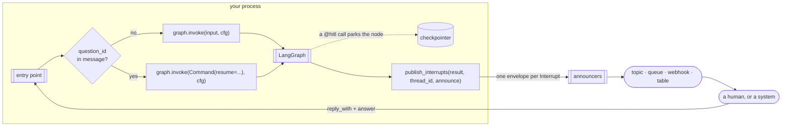

# Architecture

## The shape



The library is the `P` box. Everything else in the host is yours, and it is one `if`.

## What `publish_interrupts` reads, and why it needs nothing else

`graph.invoke()` returns the run's output. If a node called `interrupt()`, the output
carries `__interrupt__`: a sequence of `Interrupt` objects. Per the LangGraph reference,
an `Interrupt` has two attributes — `value` (what was passed to `interrupt()`) and `id`.
`ns`, `when` and `resumable` were removed in 0.6.

That is the entire input. `@hitl` packed the question and the policy into `value`;
`id` is what the answer has to carry back; `thread_id` is the one thing the result does
not echo, so the host passes it. No graph handle, no `get_state()`, no checkpointer —
the library never touches persistence, and it is not in the process when the answer
arrives.

```python
for item in result["__interrupt__"]:
    question, policy, source = unwrap(item.value)
    envelopes.append(build_envelope(thread_id, Question(item.id, question, policy, source=source)))
```

## Why not `get_state()`

It would work, and it over-reports. After one of two parallel interrupts is resumed,
`get_state().tasks[*].interrupts` still lists the finished task's id (langgraph #4796 /
#6792; reproduced on 1.2.11 in `test_spike_langgraph.py`). `result["__interrupt__"]` lists
only what *this run* raised, which is exactly the set to publish. Reading the result
instead of the state removed a filter, a caveat, and a whole class of bug.

## Two interrupt shapes, one envelope

| raised by | `Interrupt.value` | published as |
|---|---|---|
| a `@hitl` call | `{"question": {"function", "args"}, "__wait__": policy, "__source__": …}` | one envelope, that policy |
| bare `interrupt(value)` | `value` | one envelope, default policy |

LangChain's `HumanInTheLoopMiddleware` raises a third shape — one interrupt for a whole
batch of tool calls — and is **not supported**: `@hitl` on a tool the middleware also
intercepts interrupts twice. It is one or the other, and this library is the other.

## The two modes of `@hitl`

**Interrupt** (default): the wrapper raises the interrupt with `{"function", "args"}`
before the body. The thread parks. `publish_interrupts` after the run announces it. If
the function declares a `decision` parameter it always runs and receives the answer;
otherwise `{"action": "approve"}` runs it, `{"action": "approve", "args": {…}}` runs it
with those, and anything else is returned in its place, unexecuted.

**Async**: the wrapper *is* the publisher. It announces through the decorator's own
announcers, with `question_id = sha256(thread | function | args)`, and returns
`{"status": "pending_approval", "question_id"}` without running the body. Nothing is
parked; nothing is called after the run; the graph carries on. The decision arrives as a
new message and the graph acts on it however it was designed to.

The difference is *where* publishing happens — inside the function at call time, or after
the run from the result — and that in async mode LangGraph remembers nothing. The
envelope, the announcers and the recommended answer shape are identical.

## Identity

| | value | stable? |
|---|---|---|
| `question_id` | `Interrupt.id` (interrupt mode) or `sha256(thread\|function\|args)` (async) | for as long as the question stands |
| `event_id` | a fresh ULID | no — one per publish |
| `dedupe_key` | `"wait.created:<question_id>"` | yes |

Consumers deduplicate on `dedupe_key`. The same question is published again whenever a
start message is redelivered (LangGraph hands back the same `Interrupt.id` on re-entry —
verified) or an async tool is called again with the same arguments. `SqsAnnounce` sends
the key as the FIFO deduplication id; `DynamoDbAnnounce` uses it as the item key;
`WebhookAnnounce` sends it as a header.

## What LangGraph does with a duplicate answer

Nothing. A `Command(resume=…)` for a question the thread has already moved past re-runs
no node and returns the current state — verified on 1.2.11. So the host does not check
for duplicates, and the library does not offer a way to. The same holds for a *different*
answer arriving after the first: the first stands.

## LangGraph 1.2.x limitation: two interrupting tools in one `ToolNode`

Recorded by the spike, not worked around:

```text
first invoke raised      = [('<id-L>', {'which': 'a', 'x': '1'})]
after resuming it        = [('<id-L>', {'which': 'b', 'x': '2'})]
same id for both?        = True
```

Only one surfaces per run (#6624), and the second carries the *same id* as the first
(#6626): a different question under an identical `dedupe_key`, which a consumer would
discard. `Interrupt.id` is a hash of the checkpoint namespace alone; the counter that
routes resume values back to the right `interrupt()` call is not part of it. The rule is
**one `interrupt()` per node**. The spike asserts the bug is present so a LangGraph fix
fails the test and this section gets removed.

## Failure isolation

`CompositeAnnounce` catches everything an adapter raises and logs it; `BaseAnnounce` does
the same for its subclasses' `deliver()`. A Slack outage must not fail a run that has
already parked. There is no retry: the next redelivery republishes with the same
`dedupe_key`, and that is the retry.

## What is not here, on purpose

No store, no tokens, no leases, no inbound validation, no timers, no `get_state()`.
Each existed in an earlier version and each put the library on the receive path, where
every team's own opinions live. The receive path is documented in
`message-formats.md` as a recommended shape; it is not implemented.
