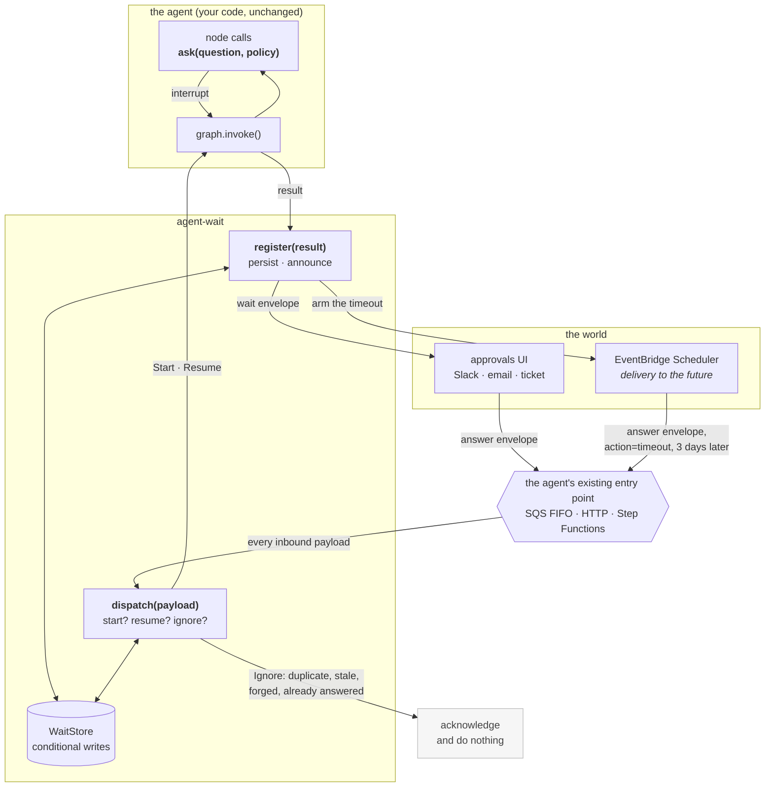

# Architecture

## The problem

Every agent framework can pause. LangGraph has `interrupt()`, Strands has interrupts,
Pydantic AI has `DeferredToolRequests`, ADK has long-running tools. None of them owns what
happens *between* the pause and the resume when the gap is three days and the process
that paused is gone.

The maintainers have said so, in writing. LangChain forum #2541: scheduling and timing are
"left to the application layer … last write wins". claude-agent-sdk-python #871: "we don't
want to keep the subprocess alive while waiting for the user". crewAI #2051: async
human-in-the-loop is Enterprise-only. langgraph #8039: after a crash, whether a node is
replayed or re-executed is host-dependent — so you cannot lean on checkpoint resume alone
for side-effect safety.

So everybody builds the same thing badly: a table of pending approvals, a cron job that
might fire twice, a webhook with no idempotency, and a refund that occasionally goes out
twice. agent-wait is that layer, built once.

## The shape



Read the arrows into `ENTRY`. The approvals UI and the scheduler send **the same kind of
message to the same place** — the queue the agent already had. That is the central idea,
and everything else follows from it.

## What that buys

**No second entry point.** No answer API to build, secure, monitor and rate-limit. One
queue policy, one authoriser, one thing that can be misconfigured.

**Timeouts stop being special.** A timeout is an answer with `action: "timeout"`,
delivered by a messenger that is three days slow. It goes through the identical code path
as a human clicking Approve — which is why "the timer fired at the same instant somebody
clicked" needs no handling at all. It is one conditional write; exactly one wins.

**No timer Lambda.** `SchedulerAnnounce` is an *announce adapter*. Telling the future is
the same act as telling Slack, so it lives behind the same one-method interface.

**Ordering is free.** SQS FIFO with `MessageGroupId = thread_id` gives one in-flight
message per conversation. That is the answer to LangChain forum #772 — "how do I ensure
only one thread_id runs at a time across many pods?" — unanswered for fourteen months.

## The three functions

```python
decision = ask(question, policy)  # in your node, instead of interrupt()

outcome = runtime.dispatch(payload)  # before graph.invoke()
result = runtime.register(out, config, thread_id)  # after it
```

That is the whole public surface, plus the `AnnounceAdapter` protocol and the two
[message formats](message-formats.md).

### `dispatch()` — the gate

Every inbound payload goes through it, and its job is to say **no** correctly. A payload
with no `token` is a start. A payload with one is an answer, and it survives: token
verification (no store read, so forged tokens cost one HMAC), the binding check (this
token is for *this* question), the allowed-actions check, the status check, the thread
lease, and finally a conditional write.

It never raises for a bad answer. A double click, a stale approval, a late timer and a
forged token are all `Ignore` — because a healthy system receives all four every day. Only
`lease_held` asks the caller to retry.

### `register()` — the ledger

Called after *every* run, including successful ones, because that is when waits left
behind by an earlier interrupt get closed out.

It computes `sha256(thread_id | interrupt_id | checkpoint_id)` and creates the wait
idempotently. Crash after the checkpoint but before the announce, and the redelivery finds
the same wait rather than making a second one. Announce once — `notified_at` is the flag —
then check whether an answer arrived before the wait existed, and if so apply it straight
away.

### The sweeper — the repair pass

`register()` does three things that are not one atomic act: create, announce, arm. A crash
in between leaves a wait nobody knows about and no timer will fire for — a thread parked
forever. The sweeper runs every minute, finds pending waits with no `notified_at`, and
announces them. It needs no graph and no checkpointer; it only ever pushes waits back onto
the announce path and lets `dispatch()` do the deciding.

## API reference — runtime operations

The three functions above are the whole of what a **graph author and a handler** must
call. Alongside them `WaitRuntime` carries three **support methods** (REQUIREMENTS §18.4).
They are ours — the sweeper and operational tooling use them — and they are not part of the
quickstart. They add no entry point and no pluggable interface.

| Method | What it does | Who calls it |
|---|---|---|
| `runtime.sweep(limit=100)` | The repair pass. Re-announces pending waits with no `notified_at`, and re-announces overdue ones so a lost schedule is re-armed. Returns `{"scanned", "announced", "overdue"}`. Every action is idempotent, so it is safe to run every minute forever. | A one-minute EventBridge rule → `make_sweep_handler`. |
| `runtime.cancel(wait_id, reason="")` | `pending → cancelled`, announced. The `cancelled` announce is what deletes the schedule. Returns `False` if the wait was already settled. Later answers get `already_answered`. | Operational tooling; a control path in your own application. |
| `runtime.envelope_for(wait, transition)` | Builds the outbound envelope (§7.1) for a wait, minting a fresh token. | The sweeper, when re-announcing. Also useful if you need to re-emit an envelope by hand. |

Two more exist for the hosting layer rather than for you: `runtime.refresh_lease(thread_id)`,
which `make_run_handler`'s heartbeat calls while a long graph runs, and the `owner` attribute
that identifies this process to the lease.

Everything else on `WaitRuntime` is private and will change without notice.

## Why the store is the only hard dependency

`WaitStore` needs exactly one primitive: **a conditional write that tells you whether you
won**. `transition()` returns a bool, not an exception, and every state change goes through
it. The loser re-reads and reports what actually happened.

That is why there are three implementations — in-memory, SQLite, DynamoDB — and one
conformance suite that runs against all three. A rule that passes only against the
in-memory store has not been tested, it has been asserted.

## What is deliberately not here

**Authentication.** `actor` in an answer envelope is a label. Anyone holding the token can
write any string there. Trust comes from the entry point — the queue policy, the API
authoriser, the IAM role. Pretending otherwise would be worse than not trying.

**A UI.** Envelopes carry `tags`, which become SNS message attributes, so filter policies
route to whatever already exists. The agent never learns your service is there.

**Cross-framework generality, yet.** `FrameworkAdapter` is five methods and the core
imports no framework, so Strands or Pydantic AI is an afternoon. But v0.1 ships one
adapter that is genuinely tested rather than four that are plausible.

**Step Functions hosting.** Designed for, not built. A Park state
(`sqs:sendMessage.waitForTaskToken` with `TimeoutSecondsPath`) would announce and time out
natively and feed `SendTaskSuccess` output back to `dispatch()` unchanged. Nothing in the
core prevents it.

## LangGraph 1.2.x caveat: `tasks[*].interrupts` over-reports

**This is the most important thing in this document if you are porting the adapter,
upgrading LangGraph, or writing a `FrameworkAdapter` of your own.**

Verified against **langgraph 1.2.11**. After resuming one of two parallel interrupts, the
*finished* task still advertises its interrupt id (langgraph #4796 / #6792). Observed,
verbatim, from the spike suite:

```text
resumed = 2b5c8373 (node 'na');  still parked = e893eec0 (node 'nb')
task 'na'   interrupts=['2b5c8373'] result={'a': {'ok': 1}} error=None
task 'nb'   interrupts=['e893eec0'] result=None            error=None
get_state().next = ('nb',)
```

Three fields, and they disagree. `next` says only `nb` is pending. `task.result` says the
same — populated for the finished task, `None` for the parked one. `tasks[*].interrupts`
lists **both**.

The obvious `still_pending()` reads `tasks[*].interrupts`, and would therefore report an
interrupt as still parked when the node that raised it has already run to completion —
which means resuming a node that already finished. That is precisely the double-side-effect
this library exists to prevent, so the adapter uses **`task.result` alongside the interrupt
id**, and treats a task that has produced a result as done.

`next` is the other honest signal, and agrees; `task.result` is used because it answers the
question per-interrupt rather than per-superstep.

The behaviour is pinned two ways, so a LangGraph release that changes it **fails loudly**
rather than silently altering ours:

* `test_known_bug_tasks_over_report_after_a_partial_parallel_resume` asserts the bug still
  reproduces. If LangGraph fixes it, that test fails and the workaround can go.
* the spike suite writes its observations to `reports/langgraph-spike-observations.txt`
  from a fixture whose teardown runs **pass or fail**, so the record of what the framework
  actually did survives a failing assertion.

Two consolations. Replaying a resume LangGraph has already applied does *not* re-run the
node — verified and pinned. And this is a second line of defence anyway: the first is the
status compare-and-set in `dispatch()`, which rejects a redelivered answer before the graph
is ever invoked.

### The related one: "applied" is not "persisted"

`dispatch()` marks a start message applied *before* the graph consumes it, so a first run
that dies before LangGraph writes a checkpoint leaves a message recorded as applied against
a thread with nothing to resume from — and replaying it with `input=None` gets
`EmptyInputError`. `FrameworkAdapter.has_checkpoint(thread_id)` is what separates the two
cases (REQUIREMENTS §18.5); on LangGraph it is a `checkpoint_id` **or** non-empty `values`,
because a thread that interrupted in its first superstep can have the former without the
latter.
