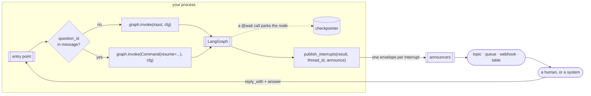

# Architecture

## The shape



The library is the `P` box. Everything else in the host is yours, and it is one `if`.

## What `publish_interrupts` reads, and why it needs nothing else

`graph.invoke()` returns the run's output. If a node called `interrupt()`, the output
carries `__interrupt__`: a sequence of `Interrupt` objects. Per the LangGraph reference,
an `Interrupt` has two attributes — `value` (what was passed to `interrupt()`) and `id`.
`ns`, `when` and `resumable` were removed in 0.6.

That is the entire input. `@wait` packed the question and the policy into `value`;
`id` is what the answer has to carry back; `thread_id` is the one thing the result does
not echo, so the host passes it. No graph handle, no `get_state()`, no checkpointer —
the library never touches persistence, and it is not in the process when the answer
arrives.

```python
for interrupt_id, value in framework.interrupts_in(result):  # LangGraph: result["__interrupt__"]
    question, policy, source = unpack(value)
    envelopes.append(build_envelope(thread_id, Question(interrupt_id, question, policy, source=source)))
```

## Interface and implementors

The user-facing pieces — `@wait`, `publish_interrupts`, the envelope, the announcers — are
written once in the core against a three-method interface, and each framework subpackage
is one implementor of it:

```python
class Framework(ABC):
    name: str
    hidden_params: tuple[str, ...]  # injected params to keep out of the published args

    def interrupt(self, value, call_args) -> Any: ...  # park on `value`; on resume, return the answer
    def interrupts_in(self, result) -> list[tuple[str, Any]]: ...  # (id, value) from what invoke() returned
    def current_thread_id(self, call_args) -> str: ...  # async mode only
```

`agent_wait.langgraph` is `LangGraphFramework` plus two lines of binding:

```python
wait = make_wait(LangGraphFramework())
publish_interrupts = make_publish_interrupts(LangGraphFramework())
```

That is the whole subpackage. A user never sees the class; they import the bound names.
The same split holds for announcers: `BaseAnnounce` is the interface, `agent_wait.aws`
is implementors. Adding a framework or a provider is a subpackage and an extra in
`pyproject.toml`, and nothing in the core changes — `agent_wait.pydantic_ai` was added
without touching it.

| | LangGraph (`[langgraph]`) | Pydantic AI (`[pydantic-ai]`) |
|---|---|---|
| `interrupt()` | `langgraph.types.interrupt(value)`; on the re-run it returns the resume value | `raise ApprovalRequired(metadata=value)`; on the re-run (`ctx.tool_call_approved`) it returns `ctx.tool_call_metadata`, or `{"action": "approve"}` if none |
| `interrupts_in()` | `result["__interrupt__"]` → `(Interrupt.id, .value)` | `result.output` when it is a `DeferredToolRequests` → `(tool_call_id, metadata[id])` for every approval and deferred call |
| `current_thread_id()` | `get_config()["configurable"]["thread_id"]` | `ctx.deps.thread_id` (or `deps["thread_id"]`) — the framework has no thread of its own |
| `hidden_params` | — | `ctx` (the `RunContext`) |
| persistence | the checkpointer | none: `message_history` is the host's, stored under `thread_id` |
| resume (host code) | `Command(resume={id: answer})` | `DeferredToolResults(approvals={id: ToolApproved() / ToolDenied(...)}, metadata={id: answer})` |
| duplicate answer | ignored by the framework | refused only if the history passed already holds the tool's return; else the tool runs again |

The user's code is the same on both: `@wait(policy)` on the function,
`publish_interrupts(result, thread_id, announce)` after the run, and one `if` on
`question_id` when the answer comes back. Only the resume line is the framework's own.

On Pydantic AI, `ToolApproved` makes the framework call the tool again with the original
arguments and `ctx.tool_call_approved = True`; the `@wait` wrapper then applies the same
rules as on LangGraph — a `decision` parameter receives the answer, `answer["args"]`
edits the call — because the answer rides in `DeferredToolResults.metadata`. `ToolDenied`
makes the framework skip the tool and hand the model the denial message, which is the
"anything else is returned in its place" rule done by the framework itself. The host
passes the answer through `metadata`, not `override_args`: `override_args` replaces the
whole argument set and bypasses the wrapper's merge.

## Two interrupt shapes, one envelope

| raised by | `Interrupt.value` | published as |
|---|---|---|
| a `@wait` call | `{"question": {"function", "args"}, "__wait__": policy, "__source__": …}` | one envelope, that policy |
| bare `interrupt(value)` | `value` | one envelope, default policy |

LangChain's `HumanInTheLoopMiddleware` raises a third shape — one interrupt for a whole
batch of tool calls — and is **not supported**: `@wait` on a tool the middleware also
intercepts interrupts twice. It is one or the other, and this library is the other.

## The two modes of `@wait`

**Interrupt** (default): the wrapper raises the interrupt with `{"function", "args"}`
before the body. The thread parks. `publish_interrupts` after the run announces it. If
the function declares a `decision` parameter it always runs and receives the answer;
otherwise `{"action": "approve"}` runs it, `{"action": "approve", "args": {…}}` runs it
with those, and anything else is returned in its place, unexecuted.

**Async**: the wrapper *is* the publisher. It announces through the decorator's own
announcers, with `question_id = sha256(thread | function | args)`, and returns
`{"status": "pending_approval", "question_id"}` without running the body. Nothing is
parked; nothing is called after the run; the graph carries on. The decision arrives as a
new message and the graph acts on it however it was designed to.

The difference is *where* publishing happens — inside the function at call time, or after
the run from the result — and that in async mode LangGraph remembers nothing. The
envelope, the announcers and the recommended answer shape are identical.

## Identity

| | value | stable? |
|---|---|---|
| `question_id` | `Interrupt.id` (interrupt mode) or `sha256(thread\|function\|args)` (async) | for as long as the question stands |
| `event_id` | a fresh ULID | no — one per publish |
| `dedupe_key` | `"wait.created:<question_id>"` | yes |

Consumers deduplicate on `dedupe_key`. The same question is published again whenever a
start message is redelivered (LangGraph hands back the same `Interrupt.id` on re-entry —
verified) or an async tool is called again with the same arguments. `SqsAnnounce` sends
the key as the FIFO deduplication id; `DynamoDbAnnounce` uses it as the item key;
`WebhookAnnounce` sends it as a header.

## What LangGraph does with a duplicate answer

Nothing. A `Command(resume=…)` for a question the thread has already moved past re-runs
no node and returns the current state — verified on 1.2.11. So the host does not check
for duplicates, and the library does not offer a way to. The same holds for a *different*
answer arriving after the first: the first stands.

## LangGraph 1.2.x limitation: two interrupting tools in one `ToolNode`

Recorded by the spike, not worked around:

```text
first invoke raised      = [('<id-L>', {'which': 'a', 'x': '1'})]
after resuming it        = [('<id-L>', {'which': 'b', 'x': '2'})]
same id for both?        = True
```

Only one surfaces per run (#6624), and the second carries the *same id* as the first
(#6626): a different question under an identical `dedupe_key`, which a consumer would
discard. `Interrupt.id` is a hash of the checkpoint namespace alone; the counter that
routes resume values back to the right `interrupt()` call is not part of it. The rule is
**one `interrupt()` per node**. The spike asserts the bug is present so a LangGraph fix
fails the test and this section gets removed.

## Failure isolation

`CompositeAnnounce` catches everything an adapter raises and logs it; `BaseAnnounce` does
the same for its subclasses' `deliver()`. A Slack outage must not fail a run that has
already parked. There is no retry: the next redelivery republishes with the same
`dedupe_key`, and that is the retry.

## What is not here, on purpose

No store, no tokens, no leases, no inbound validation, no timers, no `get_state()`.
Each would put the library on the receive path, where every team's own opinions live. The receive path is documented in
`message-formats.md` as a recommended shape; it is not implemented.
